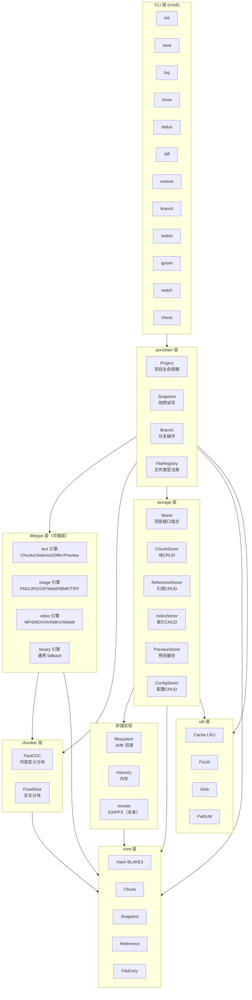
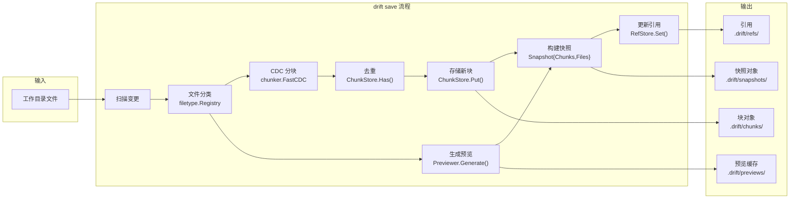
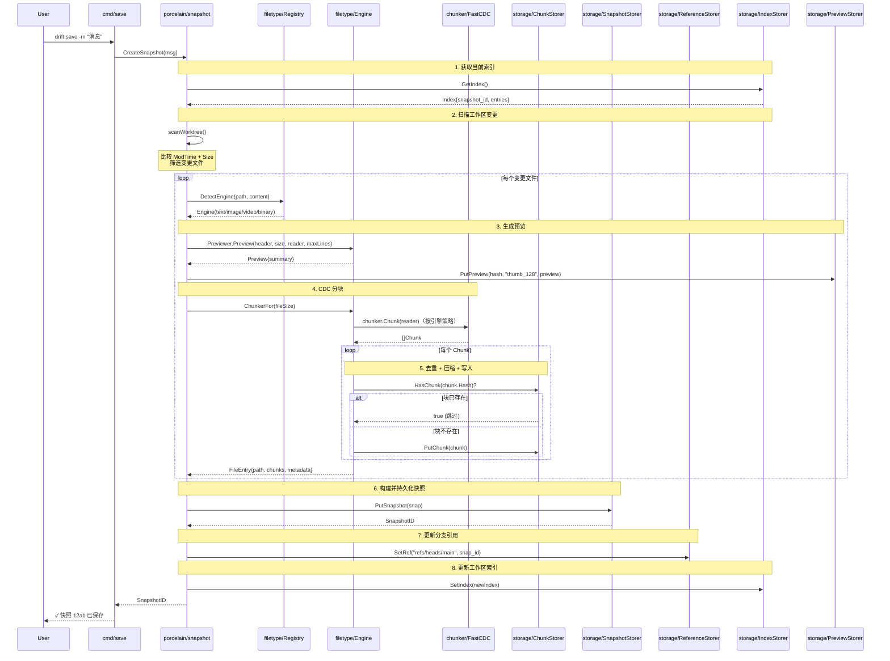
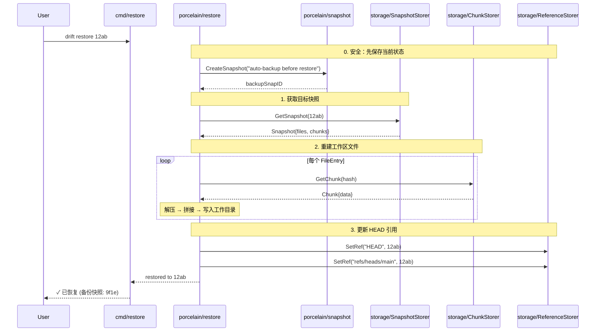
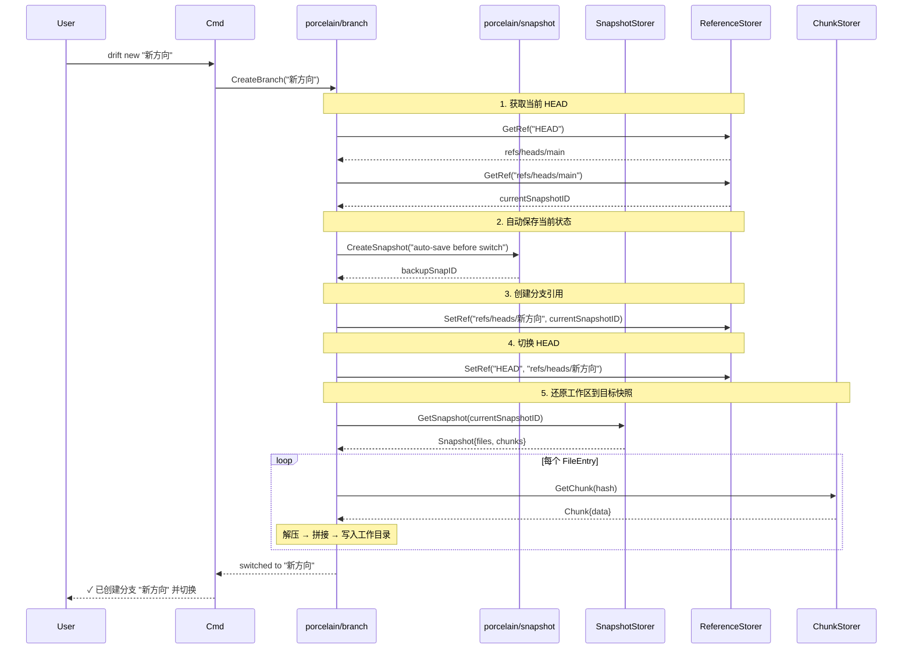

# drift 项目架构设计

---

## 目录

1. [整体架构](#1-整体架构)
2. [技术栈选型](#2-技术栈选型)
3. [模块划分](#3-模块划分)
4. [核心数据结构](#4-核心数据结构)
5. [核心业务流程](#5-核心业务流程)
6. [接口规范](#6-接口规范)
7. [安全策略](#7-安全策略)
8. [部署架构](#8-部署架构)
9. [扩展性设计](#9-扩展性设计)
10. [性能优化方案](#10-性能优化方案)

---

## 1. 整体架构

### 1.1 分层架构图

```
┌──────────────────────────────────────────────────────────────────┐
│                        CLI 层 (cmd/)                              │
│  ┌────────┬────────┬────────┬────────┬────────┬──────────────┐   │
│  │ init   │ save   │ log    │ show   │ status │ diff         │   │
│  │restore │ new    │ switch │ ignore │ watch  │ check        │   │
│  └────────┴────────┴────────┴────────┴────────┴──────────────┘   │
├──────────────────────────────────────────────────────────────────┤
│                      porcelain 层 (porcelain/)                     │
│  ┌─────────────┬─────────────┬─────────────┬──────────────────┐  │
│  │  Project    │  Snapshot    │   Branch    │  FileRegistry    │  │
│  │  (项目管理)  │  (快照管理)   │  (分支管理)  │  (文件注册)       │  │
│  └─────────────┴─────────────┴─────────────┴──────────────────┘  │
├──────────────────────────────────────────────────────────────────┤
│                    filetype 层 (filetype/)    ← 核心差异化层       │
│  ┌────────┬────────┬────────┬────────┬──────────────┐           │
│  │ Text   │ Image  │ Video  │ (未来) │  Binary      │           │
│  │Chunker │Chunker │Chunker │Chunker │  Chunker     │           │
│  ├────────┼────────┼────────┼────────┼──────────────┤           │
│  │ Text   │ Image  │ Video  │ (未来) │  Binary      │           │
│  │Differ  │Differ  │Differ  │Differ  │  Differ      │           │
│  ├────────┼────────┼────────┼────────┼──────────────┤           │
│  │ Text   │ Image  │ Video  │ (未来) │  Generic     │           │
│  │Preview │Preview │Preview │Preview │  Preview     │           │
│  └────────┴────────┴────────┴────────┴──────────────┘           │
│                                                                  │
│  ▸ 检测分层：magic bytes → 扩展名 → 启发式（见 §3.3）            │
│  ▸ 引擎注册顺序：text → image → video → binary                   │
│  ▸ 更多引擎（Audio / 3D 等）通过 Engine 接口按需扩展             │
├──────────────────────────────────────────────────────────────────┤
│                     chunker 层 (chunker/)                          │
│  ┌──────────────────────┬──────────────────────────────────────┐  │
│  │  ContentDefinedChunker│  FixedSizeChunker                    │  │
│  │  (FastCDC 算法)       │  (大文件 fallback)                   │  │
│  └──────────────────────┴──────────────────────────────────────┘  │
├──────────────────────────────────────────────────────────────────┤
│                     storage 层 (storage/)                          │
│  ┌─────────────┐  ┌─────────────┐  ┌─────────────┐              │
│  │   Storer    │  │  ChunkStore │  │  RefStore   │              │
│  │   (顶层接口) │  │  (块存储)    │  │  (引用存储)  │              │
│  ├─────────────┼──┼─────────────┼──┼─────────────┤              │
│  │ IndexStore  │  │ PreviewStore│  │ ConfigStore │              │
│  │ (索引存储)   │  │ (预览存储)   │  │ (配置存储)   │              │
│  └─────────────┘  └─────────────┘  └─────────────┘              │
│                          │                                       │
│           ┌──────────────┼──────────────┐                       │
│           ▼              ▼              ▼                       │
│  ┌─────────────┐  ┌─────────────┐  ┌─────────────┐              │
│  │  filesystem │  │   memory    │  │  s3/ipfs   │              │
│  │  (.drift/)  │  │  (测试用)    │  │  (未来)     │              │
│  └─────────────┘  └─────────────┘  └─────────────┘              │
├──────────────────────────────────────────────────────────────────┤
│                        core 层 (core/)                            │
│  ┌────────┬────────┬──────────┬─────────┬─────────┬─────────┐  │
│  │ Hash   │ Chunk  │ Snapshot  │ Ref     │ File    │ Config  │  │
│  │ (BLAKE3)│ (块)   │ (快照)    │(引用)   │(文件条目)│(配置)   │  │
│  └────────┴────────┴──────────┴─────────┴─────────┴─────────┘  │
├──────────────────────────────────────────────────────────────────┤
│                         util 层 (util/)                           │
│  ┌────────┬──────────┬─────────┬─────────┐  │
│  │ Cache  │  FsUtil  │  Glob   │PathUtil │  │
│  │ (LRU)  │(文件工具) │(模式匹配)│(路径工具)│  │
│  └────────┴──────────┴─────────┴─────────┘  │
└──────────────────────────────────────────────────────────────────┘
```

### 1.2 mermaid 架构图



### 1.3 数据流全景



---

## 2. 技术栈选型

### 2.1 最终选型

| 层次 | 选型 | 版本 | 最终打分 | 选型理由 |
|------|------|------|---------|---------|
| **语言** | Go | ≥1.22 | — | 单二进制、无运行时依赖、跨平台 |
| **CLI 框架** | spf13/cobra | v1.10.2 | ★★★★★ | 43k+ stars，K8s/Hugo/GitHub CLI 均用 |
| **哈希算法** | zeebo/blake3 | v0.2.4 | ★★★★☆ | Pure Go + AVX2，412 导入者，备选 lukechampine/blake3 (v1.4.1) |
| **CDC 分块** | PlakarKorp/go-cdc-chunkers | v1.0.0 | ★★★★☆ | 唯一成熟 Go CDC 库，ISC 许可，持续维护 |
| **文件监视** | fsnotify/fsnotify | v1.9.1 | ★★★★☆ | 10.7k stars，321k+ 依赖，备选 fork 可用 |
| **图片处理** | davidbyttow/govips | v2.18.0 | ★★★★☆ | 活跃维护（2026-03），MIT 许可，40+ 格式 |
| **压缩** | klauspost/compress/zstd | v1.18.6 | ★★★★★ | 4.9k stars，2,565+ 导入者，纯 Go |
| **序列化** | google.golang.org/protobuf | v1.36+ | ★★★★★ | Google 官方 Go protobuf，无替代品 |
| **日志** | log/slog | — | ★★★★★ | Go 1.21+ 标准库，零外部依赖 |
| **磁盘存储** | 自研 ODB | — | — | 无现成 CDC 内容寻址存储方案 |
| **LRU 缓存** | hashicorp/golang-lru/v2 | v2.0+ | ★★★★★ | 5k stars，Vault/Consul 均用，支持泛型 |

### 2.2 选型决策理由

**五星项（无争议，行业标准）**：
- `cobra` — Go CLI 领域没有第二个选择，Hugo/kubectl/GitHub CLI 都依赖它
- `klauspost/compress/zstd` — Go 生态唯一高性能纯 Go zstd 实现，restic/kopia 均使用
- `google.golang.org/protobuf` — Google 官方，Snapshot/Index 的序列化方案没有替代
- `log/slog` — Go 1.21 标准库结构化日志，零外部依赖，无需再引入 zap/zerolog
- `hashicorp/golang-lru/v2` — v2 支持泛型，Vault/Consul 同源，成熟度无问题

**四星项（有取舍，有备选）**：
- `zeebo/blake3` — 未达 v1.0 是唯一扣分项，但 4 年生产验证 + 412 导入者证明可靠。备选 `lukechampine/blake3`（v1.4.1，纯 Go 无 ASM 加速）
- `go-cdc-chunkers` — Go 生态唯一的 CDC 分块库，虽 stars 不多但 ISC 许可 + 持续维护 + Plakar 团队背书
- `fsnotify` — 2026 年 5 月的维护者争议是扣分项，备选 fork `gofsnotify/fsnotify` 随时可用
- `govips` — 需要 libvips C 库（CGO），是我们有意接受的妥协。纯 Go 方案（`imaging`/`gg`）图片处理慢 4-8x，不可接受

**自研项**：
- **ODB** — 基于 CDC 分块 + 内容寻址的对象存储。现有方案（restic/kopia 的存储层）耦合在其备份框架中无法复用，体量小而独立，自研性价比最高

### 2.3 Go Module 依赖清单

```
// go.mod
require (
    github.com/PlakarKorp/go-cdc-chunkers  v1.0.0
    github.com/davidbyttow/govips/v2       v2.18.0
    github.com/fsnotify/fsnotify           v1.9.1
    github.com/hashicorp/golang-lru/v2     v2.0.7
    github.com/klauspost/compress          v1.18.6
    github.com/spf13/cobra                 v1.10.2
    github.com/stretchr/testify            v1.10.0
    github.com/zeebo/blake3                v0.2.4
    google.golang.org/protobuf             v1.36.0
)
```

### 2.4 开发与测试工具

| 类别 | 选型 | 用途 |
|------|------|------|
| **测试** | stretchr/testify | 断言 + mock + suite，21k stars，Go 最流行测试库 |
| **基准测试** | Go bench | 分块算法性能基准 |
| **Lint** | golangci/golangci-lint | 19.1k stars，50+ linter 集成，IDE 全覆盖 |
| **格式化** | gofmt + goimports | 代码风格统一 |
| **构建** | goreleaser/goreleaser | 15.9k stars，多平台交叉编译发布 |
| **CI/CD** | GitHub Actions | 自动测试 + 发布 |

### 2.5 刻意不选的方案

| 未选 | 原因 |
|------|------|
| **Git 底层存储** | packfile 对大文件/二进制 delta 效果差，需要 CDC 分块 |
| **SQLite/RocksDB** | 增加 CGO 依赖，破坏单二进制优势。除图片处理（govips 需 libvips）外，原则上避免 CGO |
| **Rust** | 团队可能更熟悉 Go，且 go-git 架构可直接借鉴 |
| **Electron GUI** | 太重量级，后续 GUI 用 Wails(Go+Web前端) 更轻量 |
| **libgit2** | C 绑定增加复杂度，不如直接借鉴 go-git 纯 Go 实现 |

---

## 3. 模块划分

### 3.1 目录结构

```
drift/
├── cmd/                          # CLI 入口
│   ├── drift/                    # 主二进制（多二进制布局）
│   │   └── main.go               # 程序入口
│   ├── root.go                   # drift 主命令
│   ├── init.go                   # drift init
│   ├── save.go                   # drift save
│   ├── log.go                    # drift log
│   ├── show.go                   # drift show
│   ├── status.go                 # drift status
│   ├── diff.go                   # drift diff
│   ├── restore.go                # drift restore
│   ├── branch.go                 # drift branch
│   ├── switch.go                 # drift switch
│   ├── ignore.go                 # drift ignore
│   ├── watch.go                  # drift watch
│   ├── check.go                  # drift check
│   └── gc.go                     # drift gc
│
├── internal/                     # 业务实现（外部不可导入）
│   ├── porcelain/                # 业务逻辑层（"瓷器"）
│   │   ├── project.go            # 项目初始化/打开/配置
│   │   ├── snapshot.go           # 快照创建/读取/列表
│   │   ├── chunk.go              # chunkFile + computeFileHashFromChunks
│   │   ├── tag.go                # SaveTag
│   │   ├── branch.go             # 分支 CRUD
│   │   ├── switch.go             # SwitchBranch
│   │   ├── snapshot_branch.go    # ResolveSnapshotBranches + countSnapshotDiff
│   │   ├── diff.go               # diff 业务逻辑
│   │   ├── restore.go            # 恢复逻辑
│   │   ├── workspace.go          # restoreFilesToWorkspace（restore/switch 共用）
│   │   ├── lock.go               # 工作区锁
│   │   ├── watch.go              # watch 守护进程
│   │   ├── gc.go                 # 垃圾回收
│   │   └── errors.go             # 业务层 sentinel errors
│   │
│   ├── filetype/                     # 文件类型适配层（核心差异）
│   │   ├── registry.go               # 引擎注册表 + 三轮分层检测（magic/extension/heuristic）
│   │   ├── engine.go                 # Engine 接口（Detector / ChunkerSelector / Differ / Previewer / Metadata）
│   │   ├── init.go                   # 引擎注册（text → image → video → binary）
│   │   ├── text/                     # 文本引擎
│   │   │   ├── engine.go             # UTF-8 检测 + 分层检测
│   │   │   ├── chunker.go            # ChunkerFor 实现（2 档）
│   │   │   ├── differ.go             # 统一 diff（myers 算法）
│   │   │   ├── preview.go            # 前 N 行预览
│   │   │   └── metadata.go           # Metadata 实现
│   │   ├── image/                    # 图片引擎（png/jpg/gif/webp）
│   │   │   ├── engine.go             # 分层检测（magic + 扩展名）
│   │   │   ├── differ.go             # 元信息 diff（格式/尺寸/大小）
│   │   │   ├── preview.go            # 摘要信息（尺寸 + 格式 + 大小）
│   │   │   └── metadata.go           # Metadata 实现
│   │   ├── video/                    # 视频引擎（mp4/mov/avi/mkv/webm）
│   │   │   ├── engine.go             # 分层检测（magic + 扩展名）
│   │   │   ├── differ.go             # 文件大小 diff
│   │   │   ├── preview.go            # 视频摘要（含 MP4 tkhd 尺寸解析）
│   │   │   └── metadata.go           # Metadata 实现
│   │   └── binary/                   # 通用二进制引擎（fallback）
│   │       ├── engine.go
│   │       ├── chunker.go            # 委托 DefaultSelector
│   │       ├── differ.go             # 字节比较
│   │       ├── preview.go            # 占位符预览
│   │       └── metadata.go           # Metadata 实现
│   │
│   ├── chunker/                      # 分块算法层
│   │   ├── chunker.go                # Chunker 接口（Chunk(r io.Reader)）
│   │   ├── strategy.go               # 共享分块策略（DefaultSelector + 阈值常量）
│   │   ├── fastcdc.go                # FastCDC 实现
│   │   ├── fixed.go                  # 定长分块（大文件 fallback）
│   │   └── chunker_test.go
│   │
│   ├── storage/                      # 存储层
│   │   ├── storer.go                 # Storer 接口组合
│   │   ├── chunk_store.go            # ChunkStore 接口
│   │   ├── ref_store.go              # RefStore 接口
│   │   ├── index_store.go            # IndexStore 接口
│   │   ├── preview_store.go          # PreviewStore 接口
│   │   ├── config_store.go           # ConfigStore 接口
│   │   ├── snapshot_store.go         # SnapshotStore 接口
│   │   ├── clone.go                  # 共享克隆工具
│   │   ├── errors.go                 # 存储层 sentinel errors
│   │   ├── constants.go              # 存储常量
│   │   ├── refname/                  # ref 名校验
│   │   │   └── refname.go
│   │   ├── stream/                   # 流式工具（PeekHeader, HashFileContent）
│   │   │   └── stream.go
│   │   └── backends/                 # 存储后端实现
│   │       ├── filesystem/           # 磁盘存储（生产）
│   │       │   ├── storage.go
│   │       │   ├── chunk.go
│   │       │   ├── ref.go
│   │       │   ├── snapshot.go
│   │       │   ├── index.go
│   │       │   ├── preview.go
│   │       │   ├── config.go
│   │       │   └── layout.go
│   │       └── memory/               # 内存存储（测试用，镜像 filesystem 拆分）
│   │           ├── storage.go
│   │           ├── chunk.go
│   │           ├── ref.go
│   │           ├── snapshot.go
│   │           ├── index.go
│   │           ├── preview.go
│   │           └── config.go
│   │
│   ├── core/                         # 核心数据类型
│   │   ├── hash.go                   # BLAKE3 哈希类型
│   │   ├── chunk.go                  # Chunk 结构体
│   │   ├── snapshot.go               # Snapshot 结构体
│   │   ├── ref.go                    # Reference 结构体
│   │   ├── file_entry.go             # FileEntry 结构体
│   │   ├── file_mode.go              # 文件模式
│   │   └── config.go                 # 项目配置
│   │
│   └── util/                         # 工具层
│       ├── cache/
│       │   └── lru.go                # LRU 缓存封装
│       ├── format/
│       │   └── format.go             # Bytes + ImageDimensions
│       ├── fsutil/
│       │   ├── walk.go               # 目录遍历
│       │   └── atomic.go             # 原子文件操作
│       ├── glob/                     # glob 匹配引擎（支持 ** 递归通配符）
│       │   └── match.go              # .driftignore 模式匹配
│       └── pathutil/
│           └── pathutil.go           # 路径相对化/规范化
│
├── docs/                         # 文档
│   ├── prd.md                    # 产品需求文档
│   ├── cli-design.md             # CLI 命令设计
│   ├── architecture.md           # 本文档
│   ├── roadmap.md                # 路线图
│   ├── CODE_STANDARDS.md         # 代码规范
│   └── engine-plugin.md          # 引擎插件开发指南
│
├── go.mod
├── go.sum
├── AGENTS.md
├── .goreleaser.yml               # 发布配置
└── README.md
```

### 3.2 模块职责矩阵

| 模块 | 职责 | 依赖 | 被谁依赖 |
|------|------|------|---------|
| `cmd/drift/` | 程序入口（main） | cmd | 无（顶层） |
| `cmd/` | CLI 参数解析、输出格式化、命令路由 | internal/porcelain | 无（顶层） |
| `internal/porcelain/` | 业务逻辑编排、调用下层完成操作 | internal/filetype, chunker, storage, core | cmd |
| `internal/filetype/` | 文件类型检测、注册 ChunkerSelector/Differ/Previewer | internal/chunker, core | porcelain |
| `internal/chunker/` | CDC 分块算法实现 | internal/core | filetype, porcelain |
| `internal/storage/` | 数据持久化接口与实现 | internal/core, util | porcelain |
| `internal/storage/backends/` | 存储后端实现（filesystem/memory） | internal/storage, core | porcelain |
| `internal/core/` | 核心数据类型定义 | 无 | 所有模块 |
| `internal/util/` | 通用工具 | 无 | 所有模块 |

> **watch 守护进程**：`drift watch on` 通过 `porcelain.StartDaemon` 启动轮询模式后台子进程，使用 `.drift/watch.pid` 文件管理生命周期（启动/停止/状态查询）。进程管理跨平台实现：Windows 通过 `taskkill /PID` 终止，Unix 通过 `SIGTERM` 终止（见 `watch_proc_windows.go` / `watch_proc_unix.go`）。

### 3.3 核心接口定义

```go
// =================== internal/filetype/engine.go ===================

// Engine 文件类型引擎 —— 可插拔的核心抽象
// 每种文件类型通过注册自己的 Engine 实现来扩展 drift
// 通过 Go 接口组合嵌入五个能力子接口
type Engine interface {
    Detector
    ChunkerSelector
    Differ
    Previewer
    // Metadata 返回该引擎处理的文件的元数据（如 MIME 类型）。
    // 返回 nil 表示"无元数据"，调用方必须处理 nil。将此能力下沉到
    // 引擎自身（而非在 porcelain 层 switch engine.Name()）保证引擎
    // 自描述：新增引擎无需修改其包外的任何代码。
    Metadata() *core.FileMetadata
}

// Detector 分层检测器接口（Phase 3 重构）
// 单一 Detect(path, header) 方法被拆为三个独立方法，分别对应不同的
// 检测可靠性层级。Registry.Detect 按下表顺序三轮遍历所有引擎：
//
//   轮次 | 方法                  | 证据强度 | 适用场景
//   1   | DetectByMagic(header) | 最强     | 文件头有明确 magic bytes（如 PNG/JPG/MP4）
//   2   | DetectByExtension(path)| 次强     | 扩展名明确的常规文件
//   3   | DetectByHeuristic      | 最弱     | 无扩展名/未知扩展名的兜底嗅探
//
// 设计理由：
//   - magic bytes 最可靠，应优先；但并非所有格式都有签名（如 text/binary）
//   - 扩展名次之，能覆盖绝大多数用户文件
//   - 启发式最弱，仅用于兜底，避免误判
// 分层后引擎注册顺序不影响正确性（每轮内部按注册顺序短路），
// 但约定顺序 text → image → video → binary 以保证可读性。
type Detector interface {
    Name() string
    // DetectByMagic 基于文件头 magic bytes 判断（最强证据）。
    // 仅当 header 匹配本引擎已知且无歧义的签名时返回 true。
    // 不得依赖 path/扩展名。无 magic 签名的引擎（如 text/binary）恒返回 false。
    DetectByMagic(header []byte) bool
    // DetectByExtension 基于路径扩展名判断（中等证据）。
    // 不得读取 header 内容。
    DetectByExtension(path string) bool
    // DetectByHeuristic 内容嗅探兜底（最弱证据）。
    // 仅在前两轮均无匹配时调用，用于无扩展名或未知扩展名文件。
    DetectByHeuristic(path string, header []byte) bool
}

// ChunkerSelector 按文件大小返回合适的分块器。
// 返回 nil 表示"整文件单块"：调用方读取整个文件并构造单个 Chunk，其 Hash 为 BLAKE3(content)。
// 每个引擎根据文件大小自治决定分块策略，使策略与理解该类型的引擎共置一处；
// 未来引擎（如 PSD）可返回结构感知的 chunker，而无需改动 snapshot 层。
// 分块大小由各引擎私有常量决定，不通过 CoreConfig 暴露给用户配置。
type ChunkerSelector interface {
    ChunkerFor(fileSize int64) chunker.Chunker
}

// Differ 计算两个版本文件内容的差异（流式，不缓冲整个文件到内存）
type Differ interface {
    Diff(oldPath string, oldReader io.Reader, newPath string, newReader io.Reader) (string, error)
}

// Previewer 生成文件预览（文本用前N行，图片用尺寸/格式摘要，视频用容器信息）
// header 是文件头部字节（用于 magic 检测和尺寸解析），size 是文件总大小，
// reader 允许流式访问内容。仅需 header 的引擎（image/video/binary）不应读取 reader，
// 以保持大文件下内存恒定。
type Previewer interface {
    Preview(header []byte, size int64, reader io.Reader, maxLines int) (string, error)
}


// =================== internal/filetype/registry.go ===================

// Registry.Detect 三轮分层匹配实现：
//   1. 遍历所有引擎的 DetectByMagic，命中即返回（最强）
//   2. 无匹配则遍历所有引擎的 DetectByExtension（次强）
//   3. 仍无匹配则遍历 DetectByHeuristic 兜底（最弱）
//   4. 三轮均无命中返回 nil（binary 引擎始终通过 heuristic 兜底，故实际不会发生）
//
// 该分层保证：精确 magic 签名永远优先于弱启发式，
// 避免了旧版 Detect(path, header) 一锅烩时可能出现的误判。
func (r *Registry) Detect(path string, header []byte) Engine


// =================== internal/storage/storer.go ===================

// Storer 顶层存储接口 —— 接口隔离设计
type Storer interface {
    ChunkStorer
    SnapshotStorer
    ReferenceStorer
    IndexStorer
    PreviewStorer
    ConfigStorer
    io.Closer
}

// ChunkStorer 块存储 —— 内容寻址
type ChunkStorer interface {
    HasChunk(ctx context.Context, hash core.Hash) bool
    GetChunk(ctx context.Context, hash core.Hash) (*core.Chunk, error)
    PutChunk(ctx context.Context, chunk *core.Chunk) error
    DeleteChunk(ctx context.Context, hash core.Hash) error
    ListChunks(ctx context.Context) ([]core.Hash, error)
}

// SnapshotStorer 快照存储
type SnapshotStorer interface {
    GetSnapshot(ctx context.Context, id core.SnapshotID) (*core.Snapshot, error)
    PutSnapshot(ctx context.Context, snap *core.Snapshot) error
    DeleteSnapshot(ctx context.Context, id core.SnapshotID) error
    ListSnapshots(ctx context.Context, opts *ListOptions) ([]*core.SnapshotSummary, error)
}

// ListOptions 控制快照列表的分页
type ListOptions struct {
    Limit  int
    Offset int
}

// ReferenceStorer 引用存储
type ReferenceStorer interface {
    GetRef(ctx context.Context, name string) (*core.Reference, error)
    SetRef(ctx context.Context, name string, ref *core.Reference) error
    ListRefs(ctx context.Context, prefix string) ([]*core.Reference, error)
    DeleteRef(ctx context.Context, name string) error
}

// PreviewStorer 预览缓存
type PreviewStorer interface {
    GetPreview(ctx context.Context, hash core.Hash, size int) ([]byte, error)
    PutPreview(ctx context.Context, hash core.Hash, size int, data []byte) error
}

// IndexStorer 工作区索引（文件 → 块的映射）
type IndexStorer interface {
    GetIndex(ctx context.Context) (*core.Index, error)
    SetIndex(ctx context.Context, idx *core.Index) error
}

// ConfigStorer 项目配置读写
type ConfigStorer interface {
    GetConfig(ctx context.Context) (*core.Config, error)
    SetConfig(ctx context.Context, cfg *core.Config) error
}
```

---

## 4. 核心数据结构

### 4.1 数据模型

```go
// =================== internal/core/hash.go ===================

// Hash BLAKE3 哈希值，内容寻址的唯一标识
type Hash [32]byte


// =================== internal/core/chunk.go ===================

// Chunk 一个内容定义分块
// 文件被 FastCDC 算法切为多个 Chunk，相同内容的 Chunk 全局去重
type Chunk struct {
    Hash     Hash          // BLAKE3(chunk.Data)，内容寻址
    Size     uint32        // 原始大小
    Data     []byte        // 块数据（zstd 压缩后）
    Flags    ChunkFlag     // 块标记
}

// ChunkFlag represents flags for a chunk.
type ChunkFlag uint8
const (
    ChunkFlagNone       ChunkFlag = 0
    ChunkFlagCompressed ChunkFlag = 1  // 已 zstd 压缩（磁盘格式标志）
)


// =================== internal/core/file_entry.go ===================

// FileEntry 快照中的文件条目
type FileEntry struct {
    Path     string         // 文件路径
    Mode     FileMode       // 文件模式（普通/目录/符号链接）
    Size     int64          // 文件大小
    ModTime  int64          // 修改时间（unix 时间戳，用于变化检测）
    Chunks   []Hash         // 有序的分块哈希列表
    Hash     Hash           // 文件内容哈希
    Metadata *FileMetadata  // 文件元数据（MIME/尺寸/颜色空间等，可选）
}

// FileMetadata 文件类型相关的元数据
type FileMetadata struct {
    MimeType string            // "image/png", "application/x-photoshop"
    Extra    map[string]string // 扩展元数据键值对
}


// =================== internal/core/snapshot.go ===================

// Snapshot 一次保存操作创建的快照
// 等价于 Git 的 commit，但语义是"检查点"而非"提交"
type Snapshot struct {
    ID        SnapshotID    // 快照 ID（包含 Hash 字段）
    PrevID    *SnapshotID   // 父快照 ID（DAG 边），首个快照为 nil
    Message   string        // 快照消息
    Author    string        // 作者
    Timestamp int64         // unix 时间戳
    Files     []FileEntry   // 文件树（扁平列表，非递归树结构）
    Tags      []string      // 快照标签
    TotalSize int64         // 快照总大小（所有文件之和）
}

// SnapshotID 快照唯一标识
type SnapshotID struct {
    Hash Hash
}


// =================== internal/core/ref.go ===================

// Reference 引用 —— 分支或标签
type Reference struct {
    Name   string       // "HEAD", "heads/main", "tags/v1.0"
    Type   RefType      // 引用类型
    Target Hash         // 指向的快照哈希（解析后）
    SymRef string       // 符号引用目标（如 "heads/main"，不含 refs/ 前缀），非空时表示 symref
}

type RefType string
const (
    RefTypeBranch RefType = "branch"  // 分支引用（可移动）
    RefTypeTag    RefType = "tag"     // 标签引用（不可移动）
    RefTypeHead   RefType = "HEAD"    // HEAD（当前分支）
)


// =================== core/index.go ===================

// Index 工作区索引 —— 当前工作区文件到块的映射
// 用于 status 和 save 时的变更检测
type Index struct {
    Entries   []IndexEntry // 条目列表
    UpdatedAt int64        // 索引更新时间（unix 时间戳）
}

type IndexEntry struct {
    Path    string
    Hash    Hash      // 文件内容哈希（用于快速变更检测）
    Size    int64
    ModTime int64     // 修改时间（unix 时间戳）
    Chunks  []Hash    // 分块列表
}


// =================== core/config.go ===================

// Config 项目配置
type Config struct {
    User        UserConfig        // 用户信息
    Core        CoreConfig        // 核心行为配置
}

type UserConfig struct {
    Name  string  // 用户名称
    Email string  // 邮箱（可选）
}

type CoreConfig struct {
    Compression      bool   `json:"compression"`        // 是否启用压缩（默认 true）
    CompressionLevel int    `json:"compression_level"`  // zstd 压缩级别（1-19，默认 3）
    IgnoreFile       string `json:"ignore_file"`        // 忽略规则文件名（默认 .driftignore）
    AutoSaveInterval int    `json:"auto_save_interval"` // 自动保存间隔（秒，默认 300）
    AutoSaveKeep     int    `json:"auto_save_keep"`     // 自动保存快照保留数量（默认 10）
}
```

### 4.2 磁盘布局

```
.drift/
├── HEAD                  # 文本文件："ref: refs/heads/<branch>"（符号引用 symref）
├── config                # 项目配置（JSON 格式）
├── index                 # 工作区索引（protobuf 二进制）
├── workspace.lock        # 工作区并发锁文件（JSON，含 PID + 时间戳）
│
├── chunks/               # 内容寻址的块存储
│   └── ab/
│       └── cdef1234...   # 块文件：{hash[0:2]}/{hash[2:]}，1字节头部+数据
│
├── snapshots/            # 快照对象
│   └── 12/
│       └── ab3456...
│
├── refs/
│   ├── heads/
│   │   ├── main          # → snapshot_id (hex)
│   │   └── 新配色方案       # → snapshot_id (hex)
│   └── tags/
│       └── 交稿v1         # → snapshot_id (hex)
│
├── previews/             # 预览缓存
│   └── ab/
│       ├── cdef_thumb_128.jpg   # 128px 缩略图
│       └── cdef_thumb_512.jpg   # 512px 缩略图
│
└── logs/                 # 操作日志
    └── drift.log
```

> **HEAD symref 解析**：HEAD 文件位于 `.drift/HEAD`，以符号引用（symref）格式存储，内容为 `ref: refs/heads/<branch>`（含 `refs/` 前缀）。调用 `GetRef("HEAD")` 时会识别 `ref:` 前缀，自动递归解析 symref 链（HEAD → refs/heads/main → snapshot 哈希），返回的 `Reference` 中 `SymRef` 字段记录符号目标，`Target` 字段为最终解析到的快照哈希。最大 symref 递归深度为 8 层。
>
> **块文件格式**：每个块文件以 1 字节头部开头，最低位（0x01）为压缩标志，随后是原始或 zstd 压缩的块数据。读取时先校验解压后数据的 BLAKE3 哈希与文件名一致，防止数据损坏。
>
> **工作区锁**：并发控制由 porcelain 层的 `workspace.lock` 文件负责（无 storage.lock）。锁文件为 JSON 格式，包含 PID 和时间戳，支持陈旧锁自动检测（超时 10 分钟或进程不存在时自动释放）。使用 `O_CREATE|O_EXCL` 原子创建，保证无竞争。

### 4.3 序列化格式

| 数据类型 | 序列化方式 | 理由 |
|---------|-----------|------|
| **Chunk.Data** | zstd 压缩 | 块级别压缩，比 gzip 快 3-5x |
| **Snapshot** | Protocol Buffers | 紧凑、向后兼容、语言无关 |
| **Index** | Protocol Buffers | 同上 |
| **Reference** | 纯文本（行分隔） | 人可读、易调试 |
| **Config** | JSON | 简单、Go 原生支持、易编辑 |
| **Preview** | 原始二进制 (JPEG/WebP) | 无需反序列化，直接使用 |

---

## 5. 核心业务流程

### 5.1 drift save 完整流程



### 5.2 drift restore 流程



### 5.3 drift switch -c 流程



---

## 6. 接口规范

### 6.1 CLI 返回码规范

| 返回码 | 含义 |
|--------|------|
| 0 | 成功 |
| 1 | 一般错误 |
| 2 | 参数错误 |
| 3 | 存储错误（磁盘满/权限等） |
| 4 | 网络错误（后续 remote 阶段） |
| 5 | 冲突错误（锁冲突等） |

### 6.2 CLI 输出格式

```go
// stdout: 用户友好的格式化输出
// stderr: 错误信息和警告
// --json 标志: stdout 输出 JSON 格式（便于 GUI/脚本调用）

// 示例: drift save -m "msg" --json
{
  "snapshot_id": "12ab3456...",
  "sequence": 42,
  "message": "第三章初稿完成",
  "files_changed": 3,
  "files_added": 1,
  "files_modified": 1,
  "files_deleted": 1,
  "bytes_written": 1048576,
  "chunks_new": 15,
  "chunks_total": 230,
  "duration_ms": 230
}
```

### 6.3 进程间通信（GUI 阶段）

```
┌──────────┐  JSON over Unix Socket/Named Pipe  ┌──────────┐
│  CLI/GUI  │ ◄──────────────────────────────────► │  Daemon  │
│  (前端)    │    request/response                  │  (后端)   │
└──────────┘                                       └──────────┘

协议：JSON-RPC 2.0
端点示例：
  {"jsonrpc":"2.0","method":"snapshot.create","params":{"message":"..."},"id":1}
  {"jsonrpc":"2.0","result":{"snapshot_id":"...","sequence":42},"id":1}
```

### 6.4 插件协议（文件类型扩展）

```go
// filetype/registry.go

// Register 注册自定义文件类型引擎
// 第三方可通过 Go plugin 或编译时注册扩展
// 注册顺序约定：text → image → video → binary（详见 §3.3 分层检测）
func Register(engine Engine)

// 使用示例（实现分层 Detector 接口的三个方法）：
func init() {
    filetype.Register(&ClipStudioEngine{})
}

type ClipStudioEngine struct{}

func (e *ClipStudioEngine) Name() string                       { return "clip-studio" }
func (e *ClipStudioEngine) DetectByMagic(header []byte) bool   { return /* magic 嗅探 */ }
func (e *ClipStudioEngine) DetectByExtension(path string) bool { return /* 扩展名匹配 */ }
func (e *ClipStudioEngine) DetectByHeuristic(path string, header []byte) bool { return false }
// ... ChunkerSelector / Differ / Previewer 略
```

### 6.5 错误处理策略

错误在跨层传递时使用 `fmt.Errorf` 包装上下文，外部调用方用 `errors.Is` / `errors.As` 判断类型：

```go
// 错误类型层级
var (
    ErrNotFound      = errors.New("drift: not found")
    ErrAlreadyExists = errors.New("drift: already exists")
    ErrPermission    = errors.New("drift: permission denied")
    ErrLocked        = errors.New("workspace is locked by another operation")
    ErrInvalidRef    = errors.New("drift: invalid reference")
    ErrCorrupted     = errors.New("drift: data corrupted")
    ErrUnsupported   = errors.New("drift: unsupported operation")
)

// 跨层包装示例
func (fs *FSStorage) GetChunk(hash core.Hash) (*core.Chunk, error) {
    data, err := os.ReadFile(fs.chunkPath(hash))
    if os.IsNotExist(err) {
        return nil, fmt.Errorf("get chunk %x: %w", hash[:8], ErrNotFound)
    }
    if err != nil {
        return nil, fmt.Errorf("get chunk %x: %w", hash[:8], err)
    }
    return decodeChunk(data)
}

// CLI 层统一转为用户消息
// porcelain → cmd 传递 sentinel error，cmd 负责格式化输出
func formatError(err error) string {
    switch {
    case errors.Is(err, ErrNotFound):
        return "未找到该快照"
    case errors.Is(err, ErrLocked):
        return "项目正被另一个 drift 进程使用，请稍后重试"
    case errors.Is(err, ErrCorrupted):
        return "数据损坏，请运行 drift check 修复"
    default:
        return fmt.Sprintf("操作失败: %v", err)
    }
}
```

---

## 7. 安全策略

### 7.1 数据完整性

| 机制 | 实现 |
|------|------|
| **写入校验** | 块写入后立即读取并校验 BLAKE3 哈希 |
| **定期校验** | `drift check` 命令，遍历所有块校验完整性 |
| **原子写入** | 写入临时文件 → fsync → rename，杜绝半写状态 |
| **损坏恢复** | 索引保留块引用计数，损坏块通过日志追踪 |

```go
// 原子写入模式
func (fs *FSStorage) PutChunk(chunk *core.Chunk) error {
    tmpPath := fs.chunkPath(chunk.Hash) + ".tmp"
    // 1. 写入临时文件
    f, _ := os.Create(tmpPath)
    f.Write(chunk.Data)
    f.Sync()
    f.Close()
    // 2. 原子 rename
    return os.Rename(tmpPath, fs.chunkPath(chunk.Hash))
}
```

### 7.2 并发安全

| 场景 | 策略 |
|------|------|
| **多实例写入** | 工作区文件锁 `.drift/workspace.lock`（porcelain 层），非锁持有者立即报错退出；无 storage.lock |
| **watch + save 冲突** | watch 检测到锁 → 跳过本次保存 → 等待下次周期；陈旧锁（>10分钟或进程死亡）自动释放 |
| **大文件写入** | 块级写入无锁冲突（内容寻址天然无竞争） |

### 7.3 敏感文件保护

```go
// .driftignore 默认模板
var defaultIgnorePatterns = []string{
    ".drift/",          // 自身目录
    ".DS_Store",        // macOS
    "Thumbs.db",        // Windows
    "*.tmp",            // 临时文件
    "*.swp",            // vim 交换文件
    "~*",               // 备份文件
    ".env",             // 环境变量
    "*.key",            // 密钥文件
    ".git/",            // .git 目录
}
```

### 7.4 隐私策略

- **纯本地优先**：默认无网络请求，所有数据仅存 `.drift/`
- **远程存储可选**：用户需显式执行 `drift remote add` 才会配置远程
- **无遥测**：不收集任何使用数据
- **数据加密**：`drift remote add --encrypt <key>` 对远程同步数据端到端加密

---

## 8. 部署架构

### 8.1 当前阶段：单二进制分发

```
┌────────────────────────────────────────────────────────┐
│                    分发渠道                            │
│  ┌──────────┐  ┌──────────┐  ┌──────────┐            │
│  │ Homebrew │  │ Scoop    │  │ 直接下载   │            │
│  │ (macOS)  │  │ (Win)    │  │ (Linux)   │            │
│  └────┬─────┘  └────┬─────┘  └────┬─────┘            │
│       │              │              │                   │
│       └──────────────┼──────────────┘                   │
│                      ▼                                  │
│            ┌──────────────────┐                        │
│            │  drift 单二进制    │                        │
│            │  (≈15MB 编译后)    │                        │
│            └────────┬─────────┘                        │
│                     │                                   │
│        ┌────────────┼────────────┐                     │
│        ▼            ▼            ▼                     │
│   ┌─────────┐ ┌─────────┐ ┌─────────┐                 │
│   │ macOS   │ │ Windows │ │ Linux   │                 │
│   │ arm/x86 │ │ x86     │ │ arm/x86 │                 │
│   └─────────┘ └─────────┘ └─────────┘                 │
└────────────────────────────────────────────────────────┘
```

### 8.2 GUI 阶段：Wails 桌面应用

```
┌────────────────────────────────────────┐
│          Wails 桌面应用                  │
│  ┌──────────────────────────────────┐  │
│  │   Web 前端 (React/Vue/Svelte)     │  │
│  │   CLI 历史 + 缩略图可视化          │  │
│  ├──────────────────────────────────┤  │
│  │   Go 后端 (嵌入 drift 库)          │  │
│  │   porcelain 层直接调用             │  │
│  └──────────────────────────────────┘  │
└────────────────────────────────────────┘
```

### 8.3 远程协同阶段（未来）

```
┌──────────┐     ┌─────────────────┐     ┌──────────┐
│  用户 A   │────►│                 │────►│  用户 B   │
│  drift    │     │  同步中枢（可选） │     │  drift    │
│  .drift/  │◄────│  S3 / IPFS     │◄────│  .drift/  │
└──────────┘     └─────────────────┘     └──────────┘

同步模式：
  - 对等式（P2P）：无中心服务器，drift 间直连
  - 中继式（Hub）：S3 作共享存储，按块增量同步
```

---

## 9. 扩展性设计

### 9.1 文件类型扩展

新增文件类型只需实现 Engine 的四个子接口并注册：

```go
// 示例：新增 .clip (CLIP Studio Paint) 支持
type ClipStudioEngine struct{}

func (e *ClipStudioEngine) Name() string { return "clip-studio" }

// 分层 Detector（Phase 3 重构）：实现三个方法即可被 Registry 三轮检测识别
func (e *ClipStudioEngine) DetectByMagic(header []byte) bool {
    // magic bytes 嗅探（若格式有签名）
    return len(header) >= 4 && string(header[:4]) == "CSF "
}
func (e *ClipStudioEngine) DetectByExtension(path string) bool {
    return strings.ToLower(filepath.Ext(path)) == ".clip"
}
func (e *ClipStudioEngine) DetectByHeuristic(path string, header []byte) bool {
    return false // 无需启发式兜底
}

func (e *ClipStudioEngine) ChunkerFor(fileSize int64) chunker.Chunker {
    return chunker.BinaryChunkerFor(fileSize)
}

func (e *ClipStudioEngine) Diff(oldPath string, oldReader io.Reader, newPath string, newReader io.Reader) (string, error) {
    // 图层级 diff（自定义实现，流式读取）
    return clipLayerDiff(oldReader, newReader)
}

func (e *ClipStudioEngine) Preview(header []byte, size int64, reader io.Reader, maxLines int) (string, error) {
    // 提取缩略图信息（仅用 header，不读 reader）
    return clipThumbnailInfo(header)
}

func (e *ClipStudioEngine) Metadata() *core.FileMetadata {
    return &core.FileMetadata{MIMEType: "application/x-clipstudio"}
}

// 注册（在 init 或 main 中）
// 注册顺序按约定追加在 binary 之前（见 init.go）
func init() {
    filetype.Register(&ClipStudioEngine{})
}
```

### 9.2 存储后端扩展

```go
// 实现 Storer 接口即可接入新后端
type S3Storage struct {
    client   *s3.Client
    bucket   string
    cache    *lru.Cache[Hash, *core.Chunk]  // 热块缓存
    metadata *MetadataDB                    // 快照元数据索引
}

// 确保编译时检查接口合规
var _ storage.Storer = (*S3Storage)(nil)
```

### 9.3 插件系统路线图

```
Phase 1: 编译时注册（init 函数）     ← 当前
Phase 2: 配置式注册（.drift/config 声明外部引擎路径）
Phase 3: Go plugin (.so 动态加载)
Phase 4: Wasm 引擎（跨语言、安全沙箱）
```

### 9.4 API 版本策略

```
storage 接口使用语义化版本：
  - v1_storer.go  ← 稳定接口
  - v2_storer.go  ← 新增方法，不删 v1

快照格式向后兼容：
  - Snapshot{Version: 1}  ← 初始版本
  - 新版本能读取旧快照
  - 旧版本遇到新快照 → 清晰报错提示升级
```

---

## 10. 性能优化方案

### 10.1 分块优化

| 优化点 | 方案 | 预期效果 |
|--------|------|---------|
| **FastCDC 窗口** | 48 字节滑动窗口，默认平均块 256KB | 去重率 30-70%（取决于文件类型） |
| **FastCDC 参数化** | `NewFastCDCChunkerWithParams(min, avg, max int)`，默认 `NewFastCDCChunker()` 仍为 128K-256K-512K | 按文件类型选择最优分块粒度（见 §10.4） |
| **整文件单块优化** | 文本 < 64KB 不分块（ChunkerFor 返回 nil），整文件作单个 Chunk | 跳过 FastCDC 开销，索引更紧凑 |
| **大文件跳过** | > 500MB 文件使用 8MB 定长分块 | 避免 CDC 找切点 CPU 开销 |
| **并发分块** | 多文件并行分块（goroutine pool） | CPU 利用率提升 3-5x |
| **分块缓存** | 基于 ModTime + Size 的快速变更检测 | 未变文件跳过二次分块 |
| **哈希一致性** | CreateSnapshot 与 ComputeFileHash 共用 `chunkFile()`，分块布局完全相同 | 同一文件两路计算得到相同哈希，避免增量误判 |

> **FastCDC 参数约束**：底层库要求 `MinSize >= 64`、`NormalSize` 为 2 的幂、`MinSize < NormalSize < MaxSize`。
> `clampFastCDCParams` 会对非法输入自动钳位到合法范围（必要时回退默认三元组），任何输入都不会触发库 panic。

### 10.2 缓存策略

```
┌────────────────────────────────────────────────────┐
│                  缓存架构                           │
│                                                    │
│  ┌──────────────┐   ┌──────────────┐              │
│  │  Chunk Cache  │   │ Preview Cache│              │
│  │  (LRU, 256MB) │   │ (LRU, 128MB) │              │
│  │  热点块内存缓存│   │  缩略图缓存   │              │
│  └──────────────┘   └──────────────┘              │
│         │                  │                       │
│         ▼                  ▼                       │
│  ┌─────────────────────────────────┐              │
│  │         磁盘 (.drift/)           │              │
│  │  所有块 + 预览图的持久化存储      │              │
│  └─────────────────────────────────┘              │
│                                                    │
│  驱逐策略：                                        │
│  - GUI 时间线预加载最近 20 个快照的缩略图                  │
│  - CLI 操作仅缓存热点块，不加载预览                         │
│  - 超过限制按 LRU 淘汰，数据仍在磁盘                │
└────────────────────────────────────────────────────┘
```

### 10.3 存储优化

```
块存储布局（借鉴 Git loose + pack 模型）：

阶段 1: loose 模式
  .drift/chunks/ab/cdef...    每个块一个文件
  优点：写入简单、并发安全
  问题：小文件过多

阶段 2: pack 模式（自动触发）
  当单个前缀目录块数 > 128 时自动打包：
  .drift/chunks/ab/pack-001.zst  包含该前缀下所有块
  元数据存在 .drift/chunks/ab/pack-001.idx

阶段 3: GC（drift gc 命令）
  - 遍历所有快照，标记存活块
  - 删除未被任何快照引用的块
  - 合并碎片化的 pack
```

### 10.4 分块策略（各引擎 ChunkerFor 自治 + 文件大小 5 档自适应）

drift 不再使用统一的 FastCDC 默认参数，而是由各引擎通过 `ChunkerFor(fileSize)` 自治决定分块策略。`porcelain/snapshot.go` 的 `chunkFile(ctx, path, r, engine, fileSize)` 调用 `engine.ChunkerFor(fileSize)` 获取 chunker：返回 nil 走整文件单块路径，否则 `c.Chunk(ctx, r)`。text 引擎实现 2 档（<64KB 整文件 / 否则 FastCDC 4K-8K-16K）；image/video/binary 引擎共用 `chunker.BinaryChunkerFor(fileSize)` 的 3 档策略。合计仍是下表 5 档效果。`CreateSnapshot` 与 `ComputeFileHash` 共用 `chunkFile`，保证两路计算得到完全相同的分块布局与文件哈希。

> **引擎自治架构（重要）**：分块参数不暴露给用户配置——这些是算法调优参数，创作者不应调，由 filetype 引擎按文件类型自治。`CoreConfig` 中**不再包含** `ChunkMinSize/AvgSize/MaxSize` 字段；各引擎使用自己的私有常量：text 引擎用 4/8/16 KB（源码友好）；binary/image/video 引擎用 `chunker.fastCDCDefault*`（= `core.DefaultChunk*Size` = 128/256/512 KB，大文件友好）。`drift config` 仅暴露 `user.name`、`user.email`（以及未来的 `remote.*`）。

| 文件特征 | 分块策略 | 理由 |
|----------|---------|------|
| 文本 < 64KB | 整文件一块（`ChunkerFor` 返回 nil） | 太小，分块增加索引开销无收益 |
| 文本 64K-50MB | FastCDC 4K-8K-16K | 小块，行级修改去重好 |
| 二进制 < 50MB | FastCDC 128K-256K-512K（默认） | 当前默认策略，已验证 |
| 二进制 50M-500M | FastCDC 1M-2M-4M | 减少块数，降低索引膨胀 |
| 二进制 > 500M | Fixed 8M | 大文件 CDC 找切点 CPU 开销大，定长更高效 |

实现要点：

```go
// internal/chunker/strategy.go —— 二进制类引擎（image/video/binary）共享的 3 档策略
// 放在 chunker 包而非 filetype 包，是为了避免 filetype ↔ 子包循环依赖。
const (
    binaryLargeThreshold = 50 * 1024 * 1024   // 50MB
    binaryHugeThreshold  = 500 * 1024 * 1024  // 500MB
)

func BinaryChunkerFor(fileSize int64) Chunker {
    // 默认值复用 core.DefaultChunk*Size（经 fastCDCDefault*Size 别名引入）。
    // 分块大小由引擎私有常量决定，不通过 CoreConfig 暴露给用户配置。
    minSize, avgSize, maxSize := fastCDCDefaultMinSize, fastCDCDefaultAvgSize, fastCDCDefaultMaxSize
    switch {
    case fileSize < binaryLargeThreshold:
        return NewFastCDCChunkerWithParams(minSize, avgSize, maxSize)
    case fileSize < binaryHugeThreshold:
        // 按比例放大，保持 min/avg/max 比例，生成更少更大的块
        return NewFastCDCChunkerWithParams(minSize*4, avgSize*4, maxSize*4)
    default:
        // 超大文件用固定分块，基于 avg 放大以减少块数
        return NewFixedChunker(avgSize * 8)
    }
}

// internal/filetype/text/chunker.go —— 文本引擎自治 2 档
func (e *TextEngine) ChunkerFor(fileSize int64) chunker.Chunker {
    if fileSize < 64*1024 {
        return nil // 整文件单块，由 chunkFile 直接拼一个 Chunk
    }
    return chunker.NewFastCDCChunkerWithParams(4096, 8192, 16384) // 4K-8K-16K
}

// filetype/image|video|binary/chunker.go —— 复用共享策略
func (e *ImageEngine) ChunkerFor(fileSize int64) chunker.Chunker {
    return chunker.BinaryChunkerFor(fileSize)
}

// internal/porcelain/snapshot.go —— 调用方：策略选择由引擎自治，snapshot 层零分支
func chunkFile(ctx context.Context, path string, r io.Reader, engine filetype.Engine, fileSize int64) ([]*core.Chunk, error) {
    c := engine.ChunkerFor(fileSize)
    if c == nil {
        // 整文件单块：读全部内容，构造单个 Chunk{Hash: BLAKE3(content), ...}
        // ...
    }
    return c.Chunk(ctx, r)
}
```

> **整文件单块路径**：当 `ChunkerFor` 返回 nil 时，`chunkFile` 会读取整文件，生成单个 `Chunk{Hash: BLAKE3(content), Size: len(data), Data: content}`，文件级哈希仍走"块哈希串联后再 BLAKE3"的统一路径（见 `computeFileHashFromChunks`），保持与多块路径的哈希算法一致。
>
> **PSD 与未来专用引擎**：Phase 3 已将 PSD 图层分块降级为研究项（P2），当前所有 .psd 文件按"二进制"档处理。未来若引入图层感知的专用引擎，只需实现 `PSDEngine.ChunkerFor` 返回自定义结构感知 chunker（如 `PSDLayerChunker`）按图层切分，无需改动 snapshot 层。

### 10.5 性能指标目标

| 指标 | 目标 | 测试场景 |
|------|------|---------|
| `drift init` | < 100ms | 空目录 |
| `drift save` (无变更) | < 50ms | ModTime 检查，跳过所有文件 |
| `drift save` (文本变更) | < 500ms | 1000 个源文件，10 个变更 |
| `drift save` (大图变更) | < 3s | 1 个 200MB PSD 修改 |
| `drift log -l 20` | < 100ms | 表格模式，无预览渲染 |
| `drift restore` | < 5s | 恢复到 1GB 项目的旧版本 |
| 启动时间 | < 50ms | 冷启动（无缓存） |
| 内存（idle） | < 50MB | 无操作 |
| 内存（save） | < 500MB | 处理 10GB 项目 |

---

## 附录 A：与 go-git 架构关键差异

| 维度 | go-git | drift |
|------|--------|-------|
| **哈希算法** | SHA1 / SHA256 | BLAKE3（10x+ 更快） |
| **分块策略** | 无（整文件 delta） | FastCDC 内容定义分块 |
| **存储格式** | packfile（delta 链） | 内容寻址块 + zstd 压缩 |
| **文件类型** | 全部视为二进制 | 注册式引擎，按类型定制 |
| **预览/缩略图** | 无 | 存储层内置生成，GUI 时间线展示，CLI 不显示 |
| **暂存区** | 有（git add） | 无（save 自动全量） |
| **合并模型** | 三路合并 | 不做合并 |
| **远程协议** | Git smart protocol | 块级同步（未来） |
| **并发模型** | 文件锁 | 内容寻址天然无竞争 |
| **GUI** | 无（仅提供库） | CLI 先行，Wails GUI 规划中 |

---

## 附录 B：关键风险与缓解

| 风险 | 影响 | 缓解措施 |
|------|------|---------|
| FastCDC 分块开销大 | save 慢，CPU 高 | 大文件 fallback 定长分块；并发分块 |
| 块碎片化严重 | 磁盘空间浪费 | `drift gc` 打包 + 清理 |
| 图片缩略图生成慢 | save/log 卡顿 | 异步生成；LRU 缓存；增量缩略图 |
| BLAKE3 碰撞（极低概率） | 数据丢失 | 多层校验（大小 + 哈希 + 数据读取验证） |
| .drift/ 目录过大 | 备份/迁移困难 | 块级去重显著减小；gc 清理无用块 |

---

## 附录 C：开源依赖核查报告

*核查日期：2026-06-28*

### 技术栈依赖

| 依赖 | 仓库 | Stars | 许可 | 最新版本 | 活跃度 | 状态 |
|------|------|-------|------|---------|--------|------|
| spf13/cobra | github.com/spf13/cobra | ~44k | Apache-2.0 | v1.10.2 (2025-12) | 活跃 | ✅ 已确认 |
| zeebo/blake3 | github.com/zeebo/blake3 | ~800 | CC0-1.0 | v0.2.4 (2024-08) | 维护中 | ⚠️ 未达 v1.0，纯 Go + ASM，412 导入者 |
| go-cdc-chunkers | github.com/PlakarKorp/go-cdc-chunkers | — | ISC | v1.0.0 (2025-07) | 活跃 | ✅ 已确认 |
| fsnotify/fsnotify | github.com/fsnotify/fsnotify | ~10.7k | BSD-3 | v1.9.1 (2025) | 活跃 | ⚠️ 有治理争议，关注社区动态 |
| davidbyttow/govips | github.com/davidbyttow/govips | ~1.2k | MIT | v2.18.0 (2026-03) | 活跃 | ✅ 替代 bimg 的选择 |
| klauspost/compress | github.com/klauspost/compress | ~4.9k | MIT/BSD/Apache | v1.18.6 (2026-04) | 活跃 | ✅ 已确认 |
| hashicorp/golang-lru | github.com/hashicorp/golang-lru | ~5k | MPL-2.0 | v2 (2023) | 稳定 | ✅ Vault/Consul 同源 |

### 开发与测试工具

| 依赖 | 仓库 | Stars | 许可 | 状态 |
|------|------|-------|------|------|
| stretchr/testify | github.com/stretchr/testify | ~21k | MIT | ✅ 已确认 |
| golangci/golangci-lint | github.com/golangci/golangci-lint | ~19.1k | GPL-3.0 | ✅ 已确认 |
| goreleaser/goreleaser | github.com/goreleaser/goreleaser | ~15.9k | MIT | ✅ 已确认 |

### 关键发现与决策

1. **bimg → govips**：bimg（3k stars）已超过 1 年未维护，OpenSSF 评分 2.5/10。替换为 govips（1.2k stars），后者持续活跃更新（v2.18.0 at 2026-03），同样基于 libvips
2. **blake3 未达 v1.0**：zeebo/blake3 在 v0.2.4 稳定运行多年，412 个项目依赖。备选 lukechampine/blake3（v1.4.1），但 zeebo 版性能更好（AVX2 加速）
3. **fsnotify 治理问题**：2026 年 5 月发生维护者冲突，有 fork `gofsnotify/fsnotify` 作为备选。当前版本经社区验证无恶意代码，持续关注
4. **CGO 妥协**：govips 需要 CGO（libvips C 库），与我们"避免 CGO"原则冲突。但图片处理领域纯 Go 方案（imaging/gg）性能差距太大（4-8x），此为有意妥协
