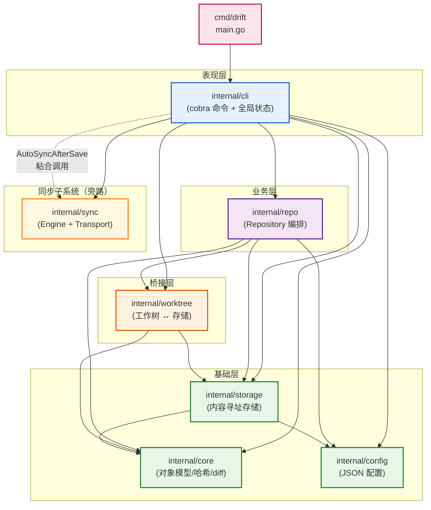
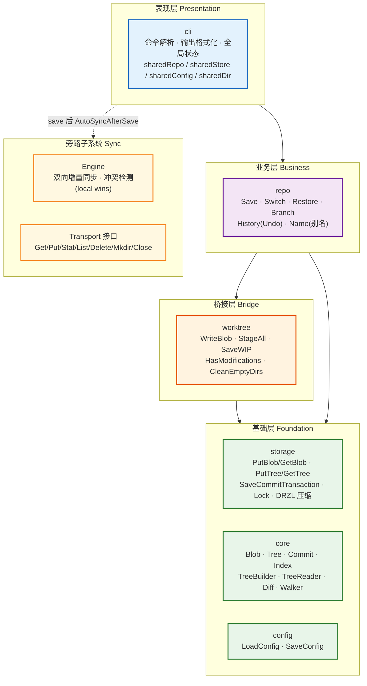
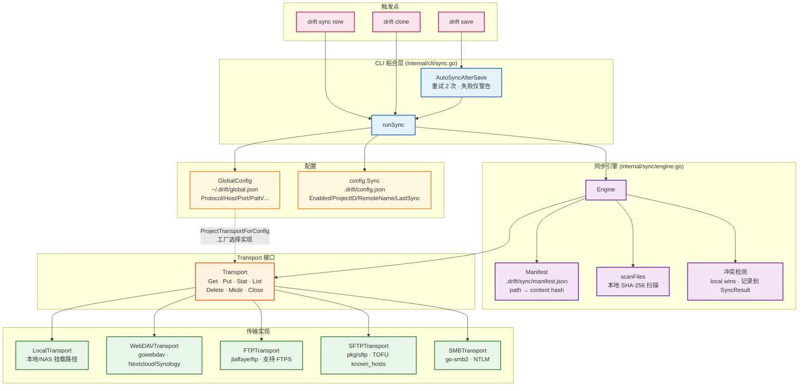

# Drift 项目架构

> 本文档使用 Mermaid 流程图展示 Drift 项目的模块结构与依赖关系。所有依赖边均基于实际 `import` 语句梳理，非假设。

## 一、模块总览

Drift 是一个单 Go 模块（`github.com/drift/drift`）、单二进制项目，入口位于 `cmd/drift/main.go`，内部拆分为 7 个包：

| 包 | 路径 | 角色 | 文件数 |
|----|------|------|--------|
| `config` | `internal/config` | 项目级 JSON 配置读写（`.drift/config.json`） | 2 |
| `core` | `internal/core` | 对象模型（Blob/Tree/Commit）、SHA-256 哈希、二进制编解码、walker、diff | ~30 |
| `storage` | `internal/storage` | 文件系统内容寻址存储、原子写、OS 锁、DRZL 压缩、LRU 树缓存 | 8 |
| `worktree` | `internal/worktree` | 工作树与对象存储之间的桥接（写 blob、暂存、WIP） | 4 |
| `repo` | `internal/repo` | 业务逻辑编排层（`Repository` 结构体，Save/Switch/Restore/Branch 等） | 7 |
| `cli` | `internal/cli` | 所有 cobra 命令 + 全局状态（`sharedStore`/`sharedConfig`/`sharedDir`/`sharedRepo`） | 33 |
| `sync` | `internal/sync` | 远程同步（`Transport` 接口 + 5 种实现：local/webdav/ftp/sftp/smb） | 7 |

## 二、模块依赖关系图

下图展示 7 个内部包 + 入口之间的实际 `import` 依赖关系。实线箭头（`-->`）表示直接 import 依赖；虚线箭头（`-.->`）表示通过 CLI 层粘合的间接协作关系（无直接 import）。



**依赖要点**：

- `core` 与 `config` 仅依赖标准库，是整个项目的最底层基石。
- `storage` 依赖 `core`（对象类型）与 `config`（存储路径），构成内容寻址存储层。
- `worktree` 桥接 `storage` 与 `core`，负责工作树文件与对象之间的转换。
- `repo` 编排 `worktree`/`storage`/`core`/`config`，是业务逻辑核心。
- `cli` 依赖几乎所有包，是唯一的顶层聚合点。
- `sync` **刻意不依赖** `core`/`storage`/`repo`，按内容哈希同步原始文件，与对象模型解耦。

## 三、分层架构

下图将 7 个包按职责划分为四层 + 一个旁路子系统：



## 四、Sync 子系统架构

`internal/sync` 是项目中最具特色的子系统：它通过统一的 `Transport` 接口抽象 5 种远程后端，由 `Engine` 执行双向增量同步，与对象模型完全解耦。



**Sync 同步流程（8 步）**：

1. 加载远端 `manifest.json`（path → hash 映射）
2. 扫描本地文件并计算 SHA-256
3. 列出远端文件列表
4. 推送本地新增/修改文件；处理远端删除（本地无则跳过）
5. 推送本地删除（远端有但本地已删）
6. 拉取远端新增/修改文件
7. 冲突检测：同一文件双向修改时 **local wins**，记录到 `SyncResult.Conflicts`
8. 保存更新后的 manifest 到远端

## 五、模块职责详解

### `internal/config` — 配置读写
- **职责**：项目级 JSON 配置的加载与原子保存。
- **关键类型**：`Config{User, Core, Sync}`、`UserConfig`、`CoreConfig`、`SyncConfig`
- **关键函数**：`LoadConfig(driftDir)`、`SaveConfig(driftDir, cfg)`、`DefaultConfig()`
- **依赖**：仅标准库

### `internal/core` — 对象模型与算法
- **职责**：定义 Blob/Tree/Commit 对象模型、SHA-256 哈希、二进制编解码（DREE/DCMT/DRIX）、工作树 walker、Myers diff、状态计算、路径校验。
- **关键类型**：`Blob`、`Tree`/`TreeEntry`、`Commit`、`Signature`、`Index`/`IndexEntry`、`TreeBuilder`、`TreeReader`、`DiffChange`、`StatusCode`
- **关键文件**：`object.go`、`blob.go`、`tree.go`、`commit.go`、`index.go`、`hash.go`、`tree_builder.go`、`tree_walker.go`、`walker.go`、`tree_codec.go`、`commit_codec.go`、`index_codec.go`、`diff.go`、`status.go`、`driftignore.go`、`pathutil.go`
- **依赖**：仅标准库

### `internal/storage` — 内容寻址存储
- **职责**：基于 SHA-256 的文件系统对象存储，支持 blob/tree/commit 的增删查、分支 ref 管理、原子事务提交、OS 级文件锁、DRZL 压缩、LRU 树缓存。
- **关键类型**：`Store`、`TreeCache`（LRU max 1024）、`Lock`
- **关键函数**：`PutBlob`/`GetBlob`/`GetBlobToWriter`（流式）、`PutTree`/`GetTree`、`PutCommit`/`GetCommit`、`SaveRef`/`GetRef`/`ListRefs`、`SaveIndex`/`LoadIndex`、`SaveCommitTransaction`、`ListBranchCommits`、`WithLock`
- **存储布局**：`.drift/objects/blobs/`、`.drift/objects/trees/`、`.drift/commits/`、`.drift/refs/`、`.drift/index`、`.drift/config.json`、`.drift/lock`（两级分片路径）
- **依赖**：`config`、`core`

### `internal/worktree` — 工作树桥接
- **职责**：在内容寻址存储与文件系统工作树之间转换；处理符号链接、可执行位、CRLF 转换、暂存、WIP 持久化。
- **关键类型**：`Worktree{Store, Root, AutoCRLF}`、`WIPData`/`WIPEntry`
- **关键函数**：`WriteBlob`、`StageAll`/`StagePaths`/`StageWorktreeChanges`、`PutBlobForAdd`、`HasModifications`、`LoadParentTreeHashes`、`CleanEmptyDirs`、`SaveWIP`/`LoadWIP`/`DeleteWIP`/`ListWIPBranches`、`NormalizePathFilters`/`PathMatchesAny`/`FilterBlobs`
- **依赖**：`core`、`storage`

### `internal/repo` — 业务编排
- **职责**：编排 worktree/storage/core/config，实现版本控制业务逻辑；记录操作日志支持 Undo。
- **关键类型**：`Repository{Store, WT, Config, Dir, GlobalUser}`、`SaveOptions`、`SaveResult`、`OperationEntry`、`RefChange`
- **关键函数**：`New()`、`Author()`、`CurrentBranch()`、`ResolveCommit()`、`Save()`、`Switch()`、`Restore()`、`CreateBranch()`/`DeleteBranch()`/`RenameBranch()`、`RecordOperation()`/`Undo()`、`AddName()`/`DeleteName()`/`ResolveName()`
- **依赖**：`config`、`core`、`storage`、`worktree`

### `internal/cli` — 命令行接口
- **职责**：所有 cobra 命令的参数解析、调用 `repo` 方法、格式化输出；持有全局状态；在 `save` 后触发自动同步。
- **全局状态**：`sharedStore`、`sharedConfig`、`sharedDir`、`sharedRepo`（由 `PersistentPreRunE` 初始化）
- **命令清单**：`init`、`add`、`rm`、`mv`、`status`、`save`、`log`、`diff`、`branch`、`switch`、`restore`、`export`、`name`、`history`、`wip`、`unstage`、`config`、`sync`、`clone`、`version`
- **依赖**：`repo`、`config`、`storage`、`sync`、`core`、`worktree`、`cobra`

### `internal/sync` — 远程同步
- **职责**：通过统一 `Transport` 接口抽象 5 种远程后端，由 `Engine` 执行双向增量同步；与对象模型解耦，按内容哈希同步整个项目目录。
- **关键类型**：`Transport` 接口、`Engine`、`Manifest`、`SyncResult`、`RemoteStat`、`GlobalConfig`、`RemoteType`、`LocalTransport`/`WebDAVTransport`/`FTPTransport`/`SFTPTransport`/`SMBTransport`
- **关键函数**：`NewEngine()`、`Engine.Sync()`、`ProjectTransportForConfig()`、`NewProjectID()`
- **依赖**：仅标准库 + 第三方传输库（`jlaffaye/ftp`、`pkg/sftp`、`studio-b12/gowebdav`、`hirochachacha/go-smb2`、`golang.org/x/crypto`）

## 六、设计要点

### 1. `sync` 为何与对象模型解耦

`sync` 包不导入 `core`/`storage`/`repo`，而是把整个项目目录（工作区文件 + `.drift/`）视为普通文件集合，用 SHA-256 内容哈希做增量传输。这样设计的原因：

- **协议无关性**：同步逻辑不关心对象内部格式，只需文件路径 + 内容哈希。
- **后端多样性**：同一套引擎可对接 local/WebDAV/FTP/SFTP/SMB 五种后端。
- **完整性独立**：`.drift/` 内的对象文件本身已有哈希校验，sync 层无需重复校验对象完整性。

### 2. CLI 层作为 `repo` 与 `sync` 的粘合

`repo` 层从不导入 `sync`，避免业务逻辑耦合网络传输。同步由 CLI 层在 `save` 成功后调用 `AutoSyncAfterSave` 触发：

```
cli.saveCmd.RunE
  → sharedRepo.Save(opts)          // 业务逻辑，返回 SaveResult
  → cli.AutoSyncAfterSave(...)     // 粘合层：失败仅警告，不影响 save 结果
    → sync.runSync
      → sync.Engine.Sync(localDir)
```

这种设计使 `repo` 可独立测试，且同步失败不会回滚已成功的本地提交。

### 3. 全局状态与未来 GUI 化

`internal/cli` 当前使用 4 个包级全局变量（`sharedStore`/`sharedConfig`/`sharedDir`/`sharedRepo`）由 `PersistentPreRunE` 初始化。这是 CLI 应用的常见模式，但对 GUI 不友好。

经近期重构，业务逻辑已全部迁移到 `repo.Repository` 结构体方法，CLI 命令仅做参数解析与输出格式化。未来 GUI 化时，只需：

1. 用 GUI 事件处理器替换 cobra 命令；
2. 用构造的 `Repository` 实例替换全局变量；
3. 复用全部 `repo`/`worktree`/`storage`/`core`/`sync` 逻辑，无需重写。

### 4. 典型命令调用链（`drift save -m "msg"`）

为佐证依赖关系，以下是一条典型命令的完整调用链：

```
cmd/drift/main.go
  → cli.Execute() → saveCmd.RunE
    → repo.Save
      → worktree.StageAll (若 --all)
      → core.TreeBuilder.BuildFromIndex → storage.PutTree (递归)
      → storage.ListBranchCommits
      → core.TreeReader.ListBlobs (计算变更路径)
      → core.NewCommit
      → storage.SaveCommitTransaction (commit + ref + index 原子写)
      → repo.RecordOperation (供 Undo)
    → cli.AutoSyncAfterSave
      → sync.ProjectTransportForConfig → *Transport
      → sync.Engine.Sync (扫描/推送/拉取/冲突检测/manifest 更新)
```
